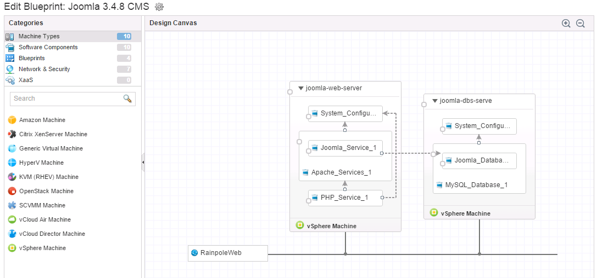
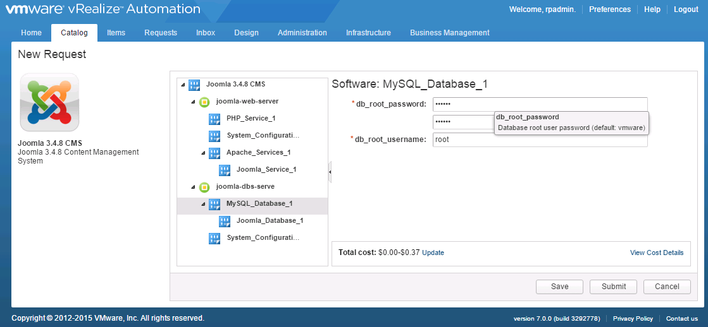
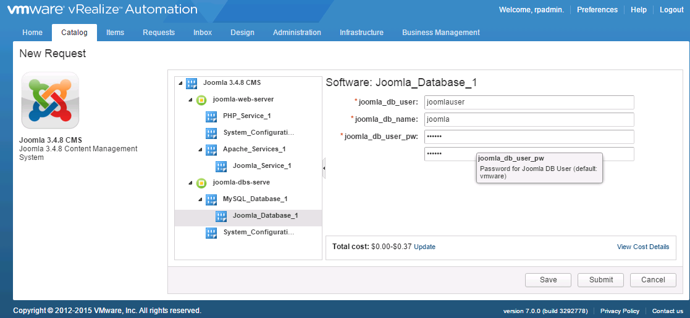
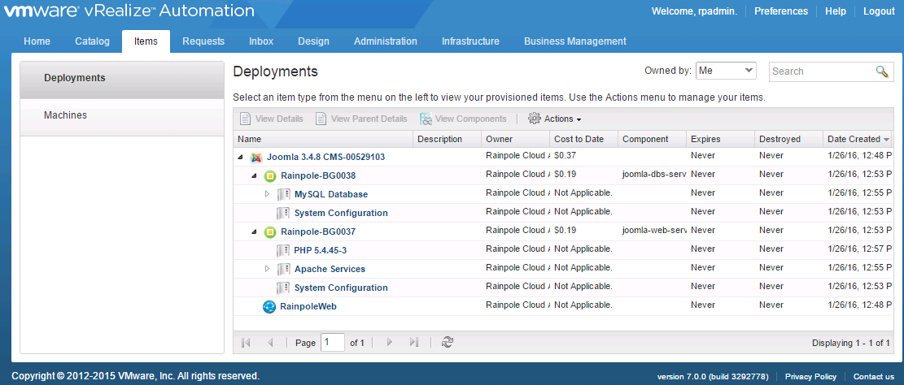
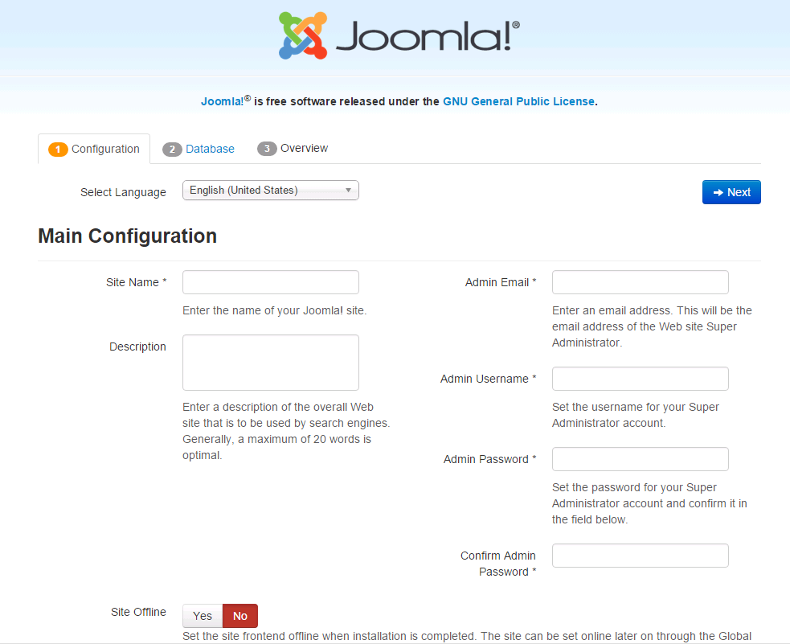

# vra-blueprint-Joomla348CMS
Joomla 3.4.8 CMS Blueprint for VMware vRealize Automation 7.0+

Binaries for Joomla, PHP, MySQL, and Apache are downloaded at time of deployment so be sure your VMs will have internet connectivity at time of deployment.

## Overview
This simple blueprint was built using two CentOS VMs: 1 for the Joomla Web server and one for the MySQL Database.

The requester may specify MySQL Settings at request time:

The Joomla Database user account and password may also be set at request time:

Once Deployed, you can retrieve the IP Address of the Web And Database VM from your Items page:

When you visit the Web server's IP Address for the first time, you'll be greeted with Joomla's Installation wizard. Just fill in the form and use the Database settings of your newly deployed DB.

## Installation
